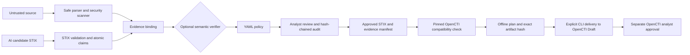
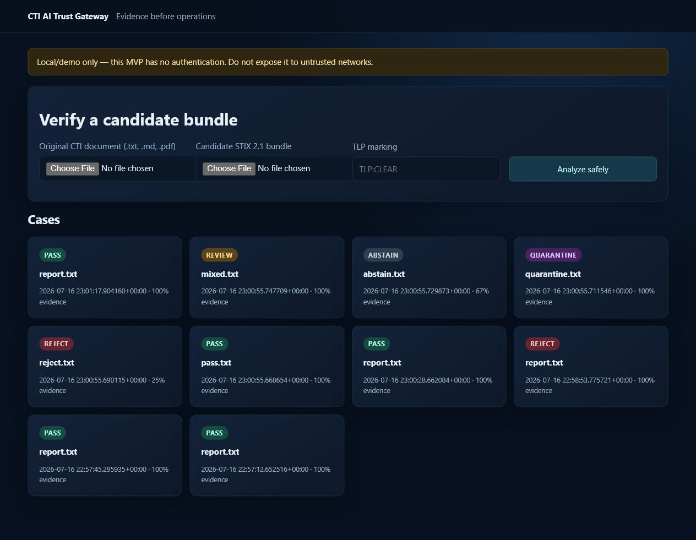
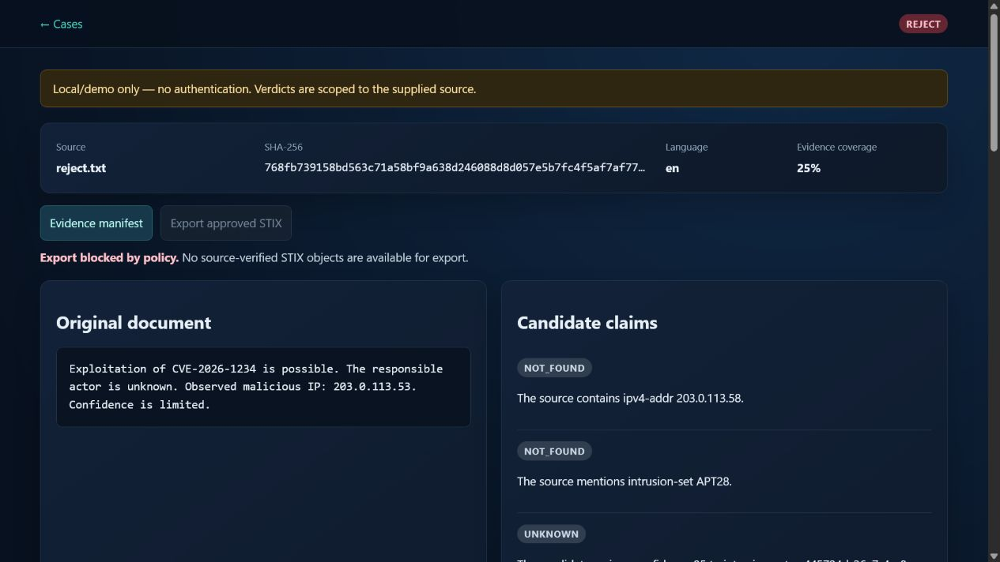

# CTI AI Trust Gateway

[](https://github.com/ag2020sa/cti-ai-trust-gateway/actions/workflows/ci.yml)

[](LICENSE)

> They generate intelligence. We verify it before it becomes operational.

**Evidence-grounded trust gateway for AI-generated cyber threat intelligence.**

**Research MVP / Beta (`0.2.0b1`) — local evaluation only, not production ready.**

> **OpenCTI Draft delivery is EXPERIMENTAL, disabled by default, contract-tested, and not live-verified.**

This prerelease adds the audited OpenCTI Phase 1 path. Live delivery remains CLI-only and requires
three explicit opt-ins; API and UI routes cannot initiate it. Read the
[`v0.2.0b1` release notes](docs/releases/v0.2.0b1.md) and
[OpenCTI Phase 1 guide](docs/opencti-phase1.md) before evaluation.

Repository: [github.com/ag2020sa/cti-ai-trust-gateway](https://github.com/ag2020sa/cti-ai-trust-gateway)

AI extraction can turn a report into polished STIX while silently changing an IP, inventing an
actor, overstating confidence, or treating two names on the same page as a proven relationship.
This local-first gateway is designed as a validation boundary before downstream CTI and security
systems. It binds candidate claims to the supplied source, applies a transparent policy, asks an
analyst where evidence is insufficient, and exports only approved objects. This release implements
approved-only STIX/evidence export and experimental OpenCTI Draft delivery. It does not provide
MISP, SIEM, or EDR integrations; those remain potential future downstream adapters. The OpenCTI
path can stage the exact approved graph in an isolated Draft for a second manual review.

For example, a report says exploitation of CVE-2026-1234 is possible, the actor is unknown, and
the observed IP is `203.0.113.53`. An AI bundle says APT28 exploited it from `203.0.113.58` with
95 confidence. The gateway passes the exact CVE mention, rejects the one-digit IP corruption with
the correct source value, refuses the invented attribution and relationship, flags confidence
inflation, and excludes rejected STIX from export.

## What it does

- Safely extracts TXT, Markdown, and PDF text, hashes original bytes, preserves pages and offsets,
  detects Arabic/English/mixed text, and scans for hidden or instruction-like content.
- Validates supported STIX 2.1 objects, identifiers, timestamps, patterns, aliases, required fields,
  duplicate objects, and dangling relationships.
- Converts STIX into atomic observable, vulnerability, ATT&CK, entity, confidence, and relationship
  claims, then attaches exact or labeled entity evidence spans.
- Applies an understandable YAML policy returning PASS, REVIEW, REJECT, QUARANTINE, or ABSTAIN.
- Serves a responsive, dependency-free analyst UI and versioned API; records eligible accept/reject
  decisions in a hash-chained audit history and rejects in-place edits that bypass re-analysis.
- Exports verified STIX plus `findings.json`, `evidence-manifest.json`, and `audit.json`.
- Checks an approved graph against an integrity-pinned OpenCTI `7.260715.0` profile, creates an
  offline delivery plan, and requires explicit CLI confirmation before sending exact canonical
  bytes to an OpenCTI Draft workspace.

It is not a threat platform, feed, chatbot, blocking system, analyst replacement, compliance
certification, perfect prompt-injection detector, or model-training project. A verdict means
“verified against this supplied source,” never “universally true.”

## Assurance boundaries

- **Deterministic verification:** exact observable values, STIX structure, identifiers, pinned
  schema execution, references, and explicit contradictions can be checked locally.
- **Semantic verification:** relationship meaning, attribution, temporal interpretation, and
  uncertainty normally remain REVIEW or ABSTAIN unless an optional verifier returns cited support.
- **Source-verified:** PASS means every mandatory check executed and passed for the supplied source;
  it does not establish global truth or freshness.
- **Human-reviewed:** REVIEW/ABSTAIN exports require an explicit eligible object decision and retain
  the original verdict, rationale, timestamp, and resulting review state. REJECT and QUARANTINE
  cannot be accepted in this unauthenticated MVP.
- **Security heuristics:** prompt-injection and hidden-PDF findings are explainable indicators, not
  a complete defense. Production still requires authentication and a sandboxed parser service.

## Architecture



The default semantic provider is deterministic and never uses the network. Exact IOCs can pass.
An entity mention does not prove attribution, and co-occurrence never proves a relationship. The
optional OpenAI-compatible provider is disabled unless an operator explicitly sets all required
environment variables; failures safely abstain. See [architecture](docs/architecture.md),
[evidence model](docs/evidence-model.md), and [policy engine](docs/policy-engine.md).

The gateway invokes `stix2-validator` with a bundled, offline OASIS STIX 2.1 schema tree pinned to
commit `c4f8d589acf2bdb3783655c89e0ffb6e150006ae`. It verifies the aggregate schema digest and records
validator version, schema source/version/hash, status, and errors in every manifest. Missing,
modified, skipped, or failed mandatory validation cannot produce PASS. An explicit
`CTI_GATEWAY_STIX_SCHEMA_DIR` override is recorded as operator-supplied. Normal analysis never
downloads schemas. See `src/cti_trust_gateway/data/stix2.1/PROVENANCE.md`.

## Analyst UI





## Quick start with `uv`

Python 3.12 and 3.13 are declared and verified in CI. Python 3.13 is also verified locally.

```bash
uv venv --python 3.12
uv pip install -e ".[dev]"
uv run cti-trust demo
uv run uvicorn cti_trust_gateway.api.app:app --host 127.0.0.1 --port 8000
```

Open <http://127.0.0.1:8000>. The UI is deliberately local/demo-only and has no authentication.

## Install the verified GitHub release

Download the wheel and checksum manifest from the `v0.2.0b1` GitHub prerelease, verify them, then
install the wheel. No package has been published to PyPI.

```bash
curl -fLO https://github.com/ag2020sa/cti-ai-trust-gateway/releases/download/v0.2.0b1/cti_ai_trust_gateway-0.2.0b1-py3-none-any.whl
curl -fLO https://github.com/ag2020sa/cti-ai-trust-gateway/releases/download/v0.2.0b1/cti_ai_trust_gateway-0.2.0b1.tar.gz
curl -fLO https://github.com/ag2020sa/cti-ai-trust-gateway/releases/download/v0.2.0b1/SHA256SUMS.txt
sha256sum --check SHA256SUMS.txt
python -m pip install ./cti_ai_trust_gateway-0.2.0b1-py3-none-any.whl
cti-trust demo
```

The release page also provides the matching source distribution. Treat the checksums as an
integrity check, not as a cryptographic publisher signature.

## Quick start with standard venv and pip

```bash
python3.12 -m venv .venv
# Linux/macOS: source .venv/bin/activate
# Windows PowerShell: .venv\Scripts\Activate.ps1
python -m pip install -e ".[dev]"
cti-trust demo
python -m uvicorn cti_trust_gateway.api.app:app --host 127.0.0.1 --port 8000
```

## Docker quick start

```bash
docker compose up --build
```

The published port is bound to `127.0.0.1`. The container drops capabilities and persists only
the local SQLite runtime volume. The Dockerfile and Compose configuration were statically reviewed,
and the image build plus live healthcheck are verified in CI.

## CLI

```bash
cti-trust verify report.pdf candidate.json
cti-trust verify report.txt candidate.json --policy policies/default.yml
cti-trust show CASE_ID
cti-trust export CASE_ID --format stix
cti-trust demo
cti-trust opencti check CASE_ID
cti-trust opencti plan CASE_ID
```

`verify` prints the final verdict, finding counts, unsupported-claim count, evidence coverage, and
absolute artifact paths under the ignored `data/runtime/exports` directory.

## OpenCTI Draft delivery

Phase 1 protects the handoff between a verified local case and OpenCTI. It prevents a caller from
bypassing validation, evidence, policy, approval, compatibility, destination, and artifact-integrity
gates. Planning is offline and persisted; live delivery is disabled by default and is CLI-only
because the research UI/API has no authentication.

```bash
# Network-free assessment and deterministic plan
cti-trust opencti check CASE_ID
cti-trust opencti plan CASE_ID --output plan.json

# Explicit network operations
cti-trust opencti probe
cti-trust opencti deliver PLAN_ID --execute \
  --confirm-plan-sha256 FULL_64_CHARACTER_PLAN_SHA256

# Local inspection and explicit recovery after an ambiguous submission
cti-trust opencti status PLAN_ID
cti-trust opencti history --case-id CASE_ID
cti-trust opencti reconcile ATTEMPT_ID
```

`deliver` without `--execute` is a dry run. Delivery creates and imports into a Draft; OpenCTI
manual approval remains mandatory. Ambiguous or partial submissions block blind retry and require
reconciliation. This is local duplicate suppression, not an atomic or exactly-once guarantee.
Configuration is environment-only; copy the safe defaults from `.env.example`. The full contract,
pins, variables, state model, security controls, and limitations are in
[OpenCTI Phase 1](docs/opencti-phase1.md).

## API

```bash
curl -s http://127.0.0.1:8000/health
curl -s -X POST http://127.0.0.1:8000/api/v1/cases \
  -F source=@report.txt \
  -F candidate=@candidate.json \
  -F tlp=TLP:CLEAR
curl -s http://127.0.0.1:8000/api/v1/cases/CASE_ID/manifest
curl -s http://127.0.0.1:8000/api/v1/cases/CASE_ID/export/stix
curl -s -X POST http://127.0.0.1:8000/api/v1/opencti/plans/CASE_ID
curl -s http://127.0.0.1:8000/api/v1/opencti/plans/PLAN_ID/history
```

Review actions accept JSON such as the reject decision below. `accept` requires an object ID and
non-empty rationale and is limited to eligible REVIEW/ABSTAIN objects. `edit` is intentionally
rejected: hard findings require a corrected candidate and complete re-analysis.

The OpenCTI HTTP surface is deliberately limited to network-free plan creation and plan/history
reads. There is no HTTP route for probing, delivery, or reconciliation.

```json
{"finding_id":"finding--...","object_id":"indicator--...","action":"reject","comment":"Attribution is unsupported"}
```

## Demo scenarios

`cti-trust demo` creates five reproducible local cases:

- PASS — exact malicious IP and CVE evidence.
- REJECT — the wrong-attribution scenario above.
- QUARANTINE — a critical visible prompt-injection phrase.
- ABSTAIN — entities co-occur but a relationship has no semantic proof.
- REVIEW — Arabic/English attribution context requires human reconciliation.

The wrong-attribution export omits the mutated IP, invented actor, and relationship. A walkthrough
is in [docs/demo-walkthrough.md](docs/demo-walkthrough.md).

## Arabic evidence

Arabic and mixed evidence retains its original characters and offsets. Search normalization never
changes the exported evidence:

```text
الجهة المسؤولة غير معروفة. لوحظ العنوان الخبيث 198.51.100.77.
```

The web interface uses automatic direction per evidence block and right-to-left layout for Arabic
documents.

## Policy example

```yaml
- id: reject-corrupted-ioc
  when: {rule_id: EVIDENCE-IOC-002}
  verdict: REJECT
  reason: An observable differs from the exact value in the source.
```

The policy response records every fired rule, its reason, and review finding IDs. Policy verdict
precedence is QUARANTINE, REJECT, REVIEW, ABSTAIN, PASS.

## Evidence manifest example

```json
{
  "schema_version": "1.0",
  "case_id": "case--...",
  "source_sha256": "...",
  "candidate_sha256": "...",
  "verdict": "REJECT",
  "validation": {
    "name": "cti-stix-validator",
    "version": "3.3.1",
    "schema_version": "c4f8d589acf2bdb3783655c89e0ffb6e150006ae",
    "schema_sha256": "43c2bf45bbaeeb44e5852553abffdebeaaa1584111d92d8a8d3a3101d8bd220f",
    "status": "EXECUTED",
    "errors": []
  },
  "evidence_coverage": 0.4,
  "claims": [{"statement": "The source contains ipv4-addr 203.0.113.58.", "status": "NOT_FOUND"}],
  "disclaimer": "Verified only against the supplied source document."
}
```

## Synthetic benchmark and licensing

Run `python scripts/build_synthetic_benchmark.py` to reproduce ten original English, Arabic, and
mixed reports plus 100 seeded mutations. The manifest states provenance, Apache-2.0 licensing,
mutation category, expected verdict, and expected finding categories. The registry stores links
and metadata only; no proprietary or public-agency report is copied.

Run `python scripts/run_synthetic_benchmark.py` to execute all mutations and fail on any verdict or
finding-category mismatch.

## Verification status

The audited Phase 1 release candidate has 224 tests, including 150 under the independent
adversarial directory, 90.44% branch-aware total coverage, and at least 95% combined OpenCTI
critical-path coverage with every critical module above 94%. The 100-mutation benchmark has zero
mismatches; Ruff, strict mypy, Bandit, pip-audit, build, Twine, and isolated-wheel verification pass
on Python 3.13.5. Python 3.12 and Docker are mandatory GitHub Actions gates. See
[`RELEASE_READINESS.md`](RELEASE_READINESS.md) and the independent
[`HANDOFF_OPENCTI_PHASE1_AUDIT.md`](HANDOFF_OPENCTI_PHASE1_AUDIT.md).

MITRE ATT&CK identifiers are used with attribution and without endorsement. CTIBench is not
vendored because it is CC BY-NC-SA; evaluate it separately under its license. See
[data strategy](docs/data-strategy.md) and [third-party notices](THIRD_PARTY_NOTICES.md).

## Security limitations

The gateway does not execute embedded content or follow document URLs during parsing. It enforces
a default 10 MB limit for both inputs, MIME/extension agreement, non-empty text, JSON depth/node
bounds, a 200-page PDF cap, and a 2,000,000-character extraction cap. It validates filenames, uses
safe JSON/YAML parsing, ignores runtime data and secrets, and adds browser security headers. Its
hidden-text scanner is heuristic, not a guarantee. PyMuPDF and all parsers remain an attack surface;
these in-process limits are not a CPU or memory sandbox.

Do not expose this MVP publicly. Production requires authentication, authorization, malware
scanning, sandboxed parser workers, rate limits, secure object storage, CSRF protection, encrypted
storage, signed audit retention, monitoring, and controlled model egress. See [SECURITY.md](SECURITY.md).

OpenCTI delivery additionally requires verified TLS, an exact host allowlist, validation of every
DNS answer, private/loopback opt-in, blocked redirects and metadata/link-local targets, bounded
responses, environment-only secrets, and no automatic submission retry. See
[OpenCTI Phase 1](docs/opencti-phase1.md#network-and-secret-controls).

## Development

```bash
make format
make lint
make typecheck
make test
make coverage
```

Windows users can run the equivalent `.venv\Scripts\python.exe -m ...` commands. Contributions
must include deterministic tests and must not include real reports, uploads, secrets, databases,
or exports. See [CONTRIBUTING.md](CONTRIBUTING.md).

## Roadmap

- Authenticate analysts and add role-based review queues.
- Isolate PDF parsing in resource-constrained workers and add malware scanning.
- Add signed, append-only external audit storage and organization policy packs.
- Add an authenticated production OpenCTI approval queue and a separately scoped MISP adapter.
- Add ATT&CK catalog pinning, richer bilingual contradiction checks, and calibrated semantic
  provider evaluations against separately licensed benchmarks.

Licensed under Apache-2.0. No referenced organization endorses this project.
