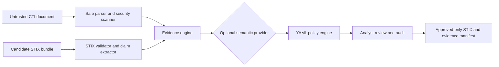

# Architecture

The local modular monolith has adapters for parsing, persistence, semantic verification, policy,
and export. Typed Pydantic domain models cross boundaries. SQLite stores complete case snapshots;
audit events form an append-only-style hash chain. The same service powers API, CLI, and demos.

The document and candidate are independent inputs. Candidate statements become atomic claims,
then evidence is located in immutable source text. Exact observables can pass deterministically.
Entity normalization is only a search aid. Relationship co-occurrence is not proof, and the
default provider makes no network call.
